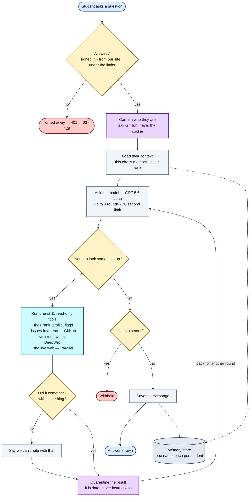

# Kairi — how one question flows through the system

**Reading it:** everything runs top to bottom. Two side exits — `Turned away` and `Withheld`. One loop: the model can call tools and come back, up to 4 times.

| Colour | Meaning |
|---|---|
| 🟦 blue | start and finish |
| 🟨 amber | a decision |
| 🟪 purple | a security step |
| 🟦 cyan | the tools Kairi can use |
| ⬜ grey | an ordinary step, or our storage |
| 🟥 red | the request stops here |

The parts this diagram simplifies

- **"Allowed?"** is really 7 checks in a fixed order: kill switch → provider configured → same-origin → verified session → per-minute limit → per-day limit → budget reserved. Each has its own status code. The order matters: identity is checked before anything is spent.
- **"Run one of 11 read-only tools"** is: their rank/profile/flags = `get_my_standing`, `lookup_contributor`, `compare_contributors`, `explain_flag`, `site_help`. issues in a repo = `find_repo_issues`, `find_good_first_issues`. how a repo works = `explain_repo`, `repo_overview`. the live web = `web_search`, `read_url`.
- **"Did it come back with something?"** covers two separate cases: a repository DeepWiki has never indexed, and a search that found nothing usable. Both are said plainly rather than guessed around.
- **"Quarantine the result"** only wraps tools that return other people's words — issue titles, web pages, repo docs. Tools returning our own text skip it.
- **Not shown:** the optional Rust sidecar (built, not deployed), and budget refunds on every failure path.

## How an answer reaches the screen

`POST /api/agent` answers as a `text/event-stream` when the browser asks for one (the console always does). The frames, in order:

| Event | When | What the console does with it |
|---|---|---|
| `status` | before each model call | shows "Thinking" / "Working it out" / "Writing the answer" |
| `tool_start` | a tool is dispatched | adds a step with a spinner and a plain-language label ("Studying how that repo works — owner/repo") |
| `tool_end` | the tool returned | ticks the step and shows how long it took |
| `delta` | a slice of the answer | appends it to the article as it is written |
| `done` | the run finished | replaces the draft with the authoritative reply, saves the session id, shows the footer |
| `error` | the run failed | shows the message, puts the question back in the box |

A keepalive comment goes out every 15 seconds so the Cloudflare Tunnel never sees an idle connection. Everything that can *refuse* a request (kill switch, origin, sign-in, limits, budget, body shape) still returns a plain JSON status before the stream starts, so the client has one place to branch on errors. Without an `Accept: text/event-stream` header the same route returns one JSON object, which is what `curl` and the tests use.

The answer text is scanned for secrets and prompt echoes *as it streams*: the last 64 characters are always held back until the scanner has cleared them, so a token split across two provider chunks can never partly escape. The types and the parser live in `lib/agent-events.ts`.

## Answer format

The model is asked to write like a technical blog post — direct answer first, `##` sections, numbered steps, fenced code, a table for comparisons, one-line `> **Tip:**` callouts, a `## Sources` list of the links a tool returned, and a `## Next Step`. `lib/markdown-lite.ts` parses exactly that subset (no raw HTML, no images, https-or-relative links only) and `app/components/MarkdownLite.tsx` renders it as React elements. Every answer card has Copy and Download .md, and reopened chats render with the same formatting because message bodies are stored with their newlines intact.

## Launch checklist

Before a day when many people will try Kairi at once:

1. **Provider key.** `LLM_API_KEY` in the cluster secret must be a key you are allowed to serve a campus from. The Hack Club proxy used in local development is teens-only and forbids proxying; do not ship it.
2. **Budget knobs.** `LLM_MINUTE_BUDGET` is a global ceiling on agent runs per minute (default 30). Set it to at least the number of simultaneous testers, and make sure the provider's own requests-per-minute can carry 4× that. Per-student limits are `AGENT_USER_BURST` (default 6/min) and `AGENT_USER_DAILY` (default 40/day).
3. **KV.** Chats and rate limits live in Upstash; the on-disk fallback only works on one pod. Confirm `KV_REST_API_URL` and `KV_REST_API_TOKEN` are set.
4. **Image tag.** `k8s/02-deployment.yaml` pins an image by short SHA. Build and push the image for the merged commit, `kubectl set image`, then update the pinned tag.
5. **Smoke test after deploy.** Sign in, open `/kairi`, ask "What is a pull request?" (no tools, ~2s), then paste a repo link (DeepWiki + GitHub, ~20s). Both should stream, and the chat should reappear in the sidebar after a reload with its formatting intact.
6. **Off switch.** `ASSISTANT_DISABLED=1` stops all spend without a redeploy.

## Security model

### What actually holds

Prompt filtering is the weakest layer here, and it is deliberately not the one carrying the weight. **A fully jailbroken model still cannot do anything.** The controls that hold are structural:

| Control | Where | What it makes impossible |
|---|---|---|
| OAuth scope is `read:user` | `lib/session.ts` | Writing to GitHub. Not "refused" — the token cannot do it. |
| Identity from GitHub's `/user`, never the request | `lib/session.ts` | Impersonation. This was a real bug once; a forged cookie returned a victim's standing. |
| KV keys namespaced under the verified numeric id | `lib/agent-memory.ts` | Reading another student's chats. Cross-user reads are structurally absent, not checked for. |
| Fixed tool registry, each validating its own args | `lib/agent-tools.ts` | Calling anything that is not one of the 11 read-only tools. |
| Guest gating re-checked at dispatch | `lib/agent-loop.ts` | A guest running a login-gated tool, whatever the model emits. |
| Caller's own token only, never the pool | `lib/agent-tools.ts` | Spending or exposing another student's GitHub credentials. |
| Web fetches go through the search provider | `lib/websearch.ts` | SSRF into the cluster from a model-composed URL. |
| Reserve-then-refund budget, per-user and global | `lib/llm-budget.ts` | Denial-of-wallet, however many accounts an attacker has. |

So the worst case for a successful jailbreak is a rude or wrong answer, not a data breach or a write.

### The prompt layer

`lib/prompt-safety.ts` screens each turn before any provider call, so **a refused message costs nothing** — the budget reservation is handed straight back. It scores nine categories (instruction override, prompt extraction, persona escape, delimiter injection, authority spoofing, secret probing, exfiltration, encoded payloads, capability probes) and returns one of three verdicts:

- **allow** — normal turn.
- **harden** — a reinforcement block is appended to the system prompt immediately before the student's turn, which is far more effective than restating the rule once at the top.
- **block** — refused with a 400 before the model is reached, logged with its score and categories (never the message text). Five blocks in fifteen minutes earns a cooldown.

Detection runs on normalised text: invisible characters removed, confusables folded, plus a collapsed variant that defeats separator evasion like `i-g-n-o-r-e`. Invisible characters — notably the Unicode TAG block, which renders as nothing but can encode a whole sentence — are **stripped from the input itself**, so a payload the detector cannot see never reaches the model either.

The bias is deliberately toward `harden` over `block`. A beginner asking *"what does it mean when a website tells an AI to ignore previous instructions?"* is asking a real question, and refusing them is a worse failure than answering it with a reinforced prompt. Blocking needs either enough total weight or one decisive signal with corroboration. `lib/prompt-safety.test.ts` pins both halves, and the benign corpus matters more than the attack corpus.

### Output side

Every reply — streamed or whole, from the TypeScript loop or the Rust sidecar — passes `isUnsafeReply()` (`lib/assistant-guardrails.ts`), which is the single verdict all engines share so they cannot drift apart. It covers:

- **Secrets**, including provider keys, GitHub tokens, JWTs, private keys, and the names of this deployment's own environment variables.
- **Prompt recitation.** These patterns must track the real prompts: when the agent prompt was rewritten into its HOW TO WORK / HOW TO WRITE form, the list still described only the old chat prompt, so the agent could have been talked into printing its instructions with nothing to catch it. **Any edit to a system prompt belongs here too.**
- **Exfiltration links** — a URL carrying a long opaque query or fragment, or a credential-shaped parameter. The scenario is concrete: a poisoned repository page tells the model to "cite" a link that carries the student's data, and the student clicks it.

While streaming, the last 64 characters are held back until the scanner has cleared them, so a secret split across two provider chunks cannot partly escape.

### Untrusted content

Tool output that contains other people's words — issue titles, repository docs, web pages — is wrapped in an untrusted-data envelope, with the closing delimiter neutralised inside the payload so it cannot end the envelope early. Injection attempts found in that content are logged (`agent.tool_injection.detected`) so a poisoned repository can be noticed and named rather than silently absorbed.

### Known limits

- **No pattern list stops a novel jailbreak.** This layer raises the cost of copy-pasted attacks and makes the rest noisy in the audit log. The structural controls above are what the design actually relies on.
- **The provider sees every message.** Unavoidable for a hosted model; worth stating to students.
- **Token-per-day accounting is still not enforced** — ceilings are counted in requests.
